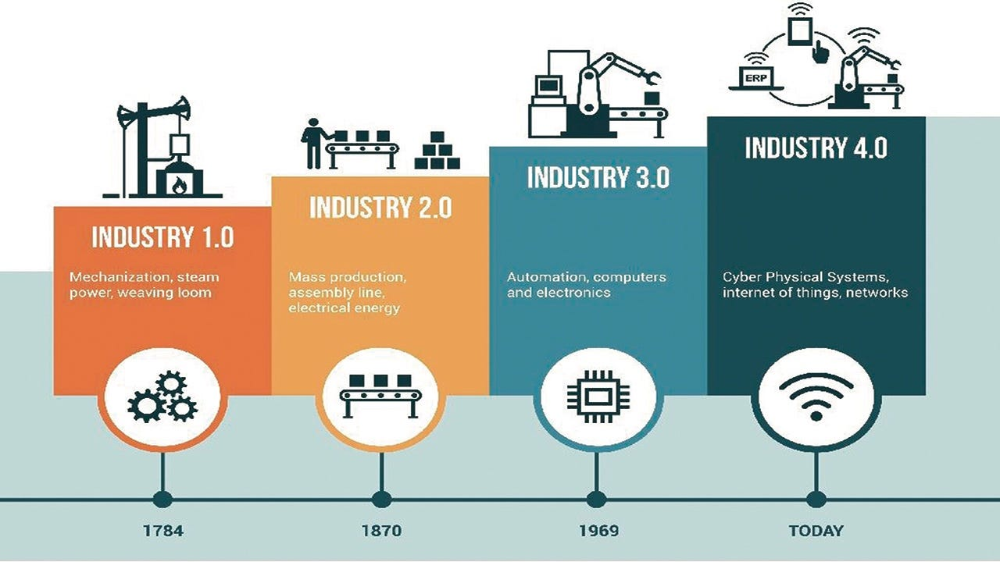
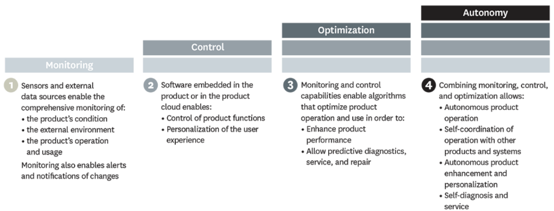

# Modul 1 - Introduction to Internet of Things (IoT)

Saat ini, kita berada pada era revolusi industri 4.0 dimana seluruh pekerjaan bukan hanya sekadar diautomasi, melainkan sudah menyentuh level integrasi antarsistem melalui jaringan yang saling terhubung satu sama lain. Oleh karena itu, pemahaman terhadap konsep Internet of Things dan jaringan sangat diperlukan pasar atau para pelaku industri. Harapannya, di Club Internet of Things (IoT) Ristek HMIT ini, kita sama-sama saling belajar dan diskusi terkait hal tersebut.

## What is IoT?

Internet of Things merupakan sebuah jaringan dari objek fisik — “things” yang disematkan juga sensor, software (firmware), dan teknologi lainnya yang bertujuan untuk saling terkoneksi dan bertukar data dengan device atau sistem lain melalui internet.

## Mengapa harus IoT?

