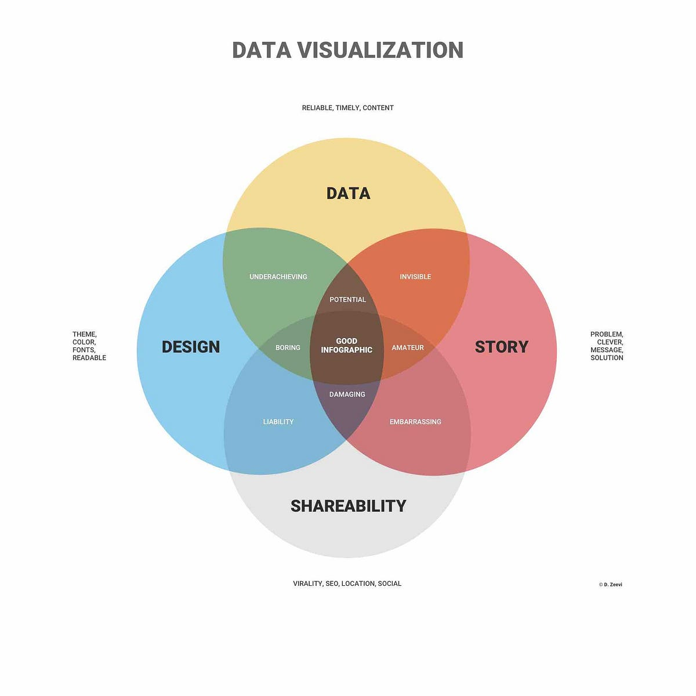
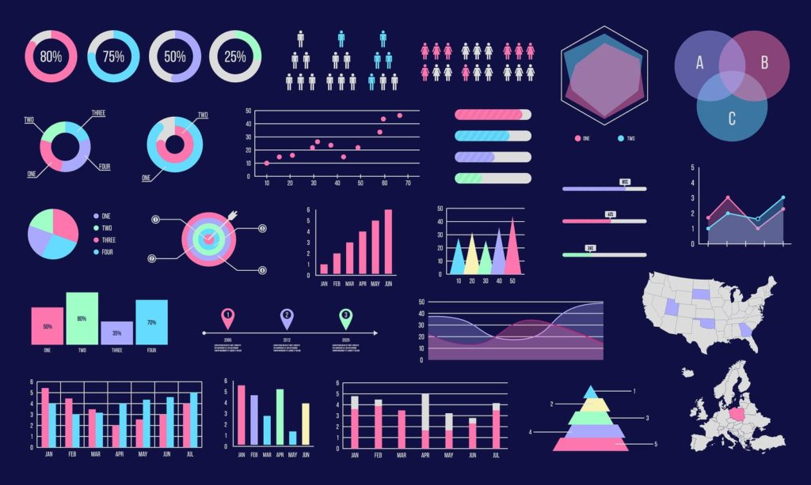
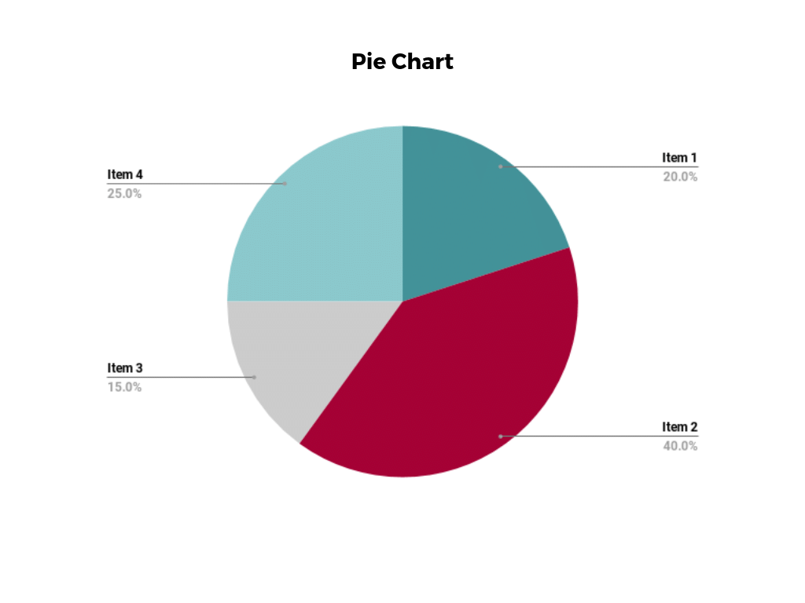
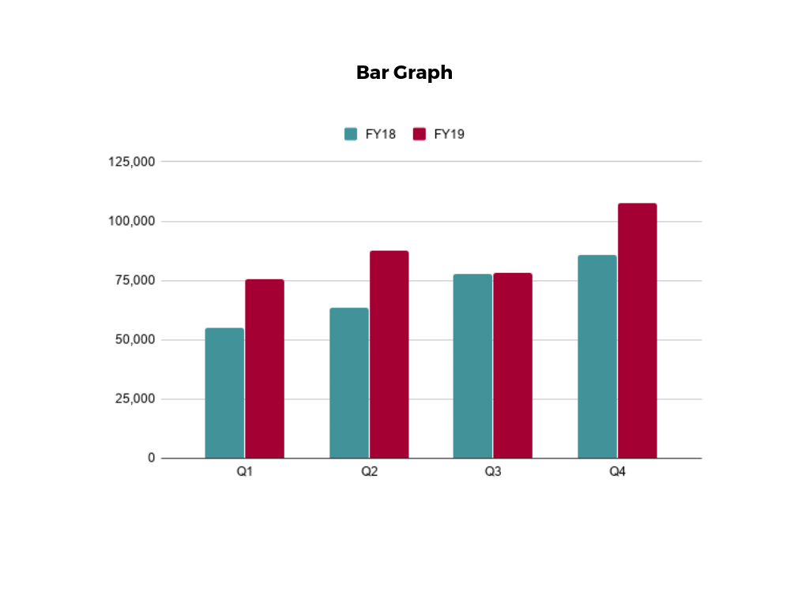
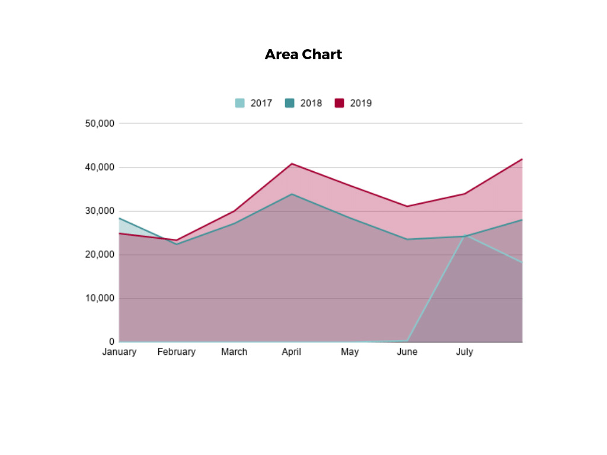
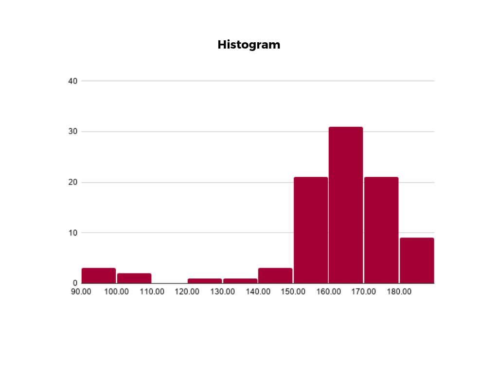
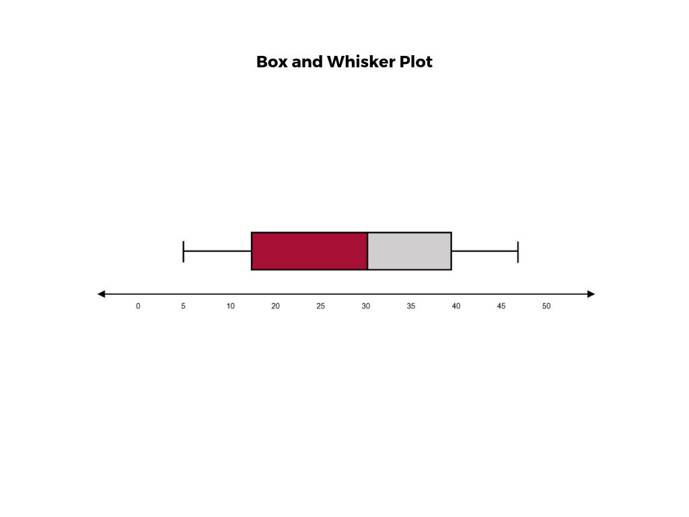
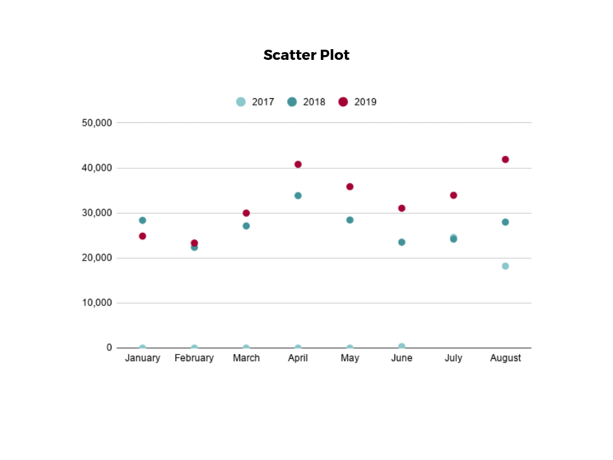
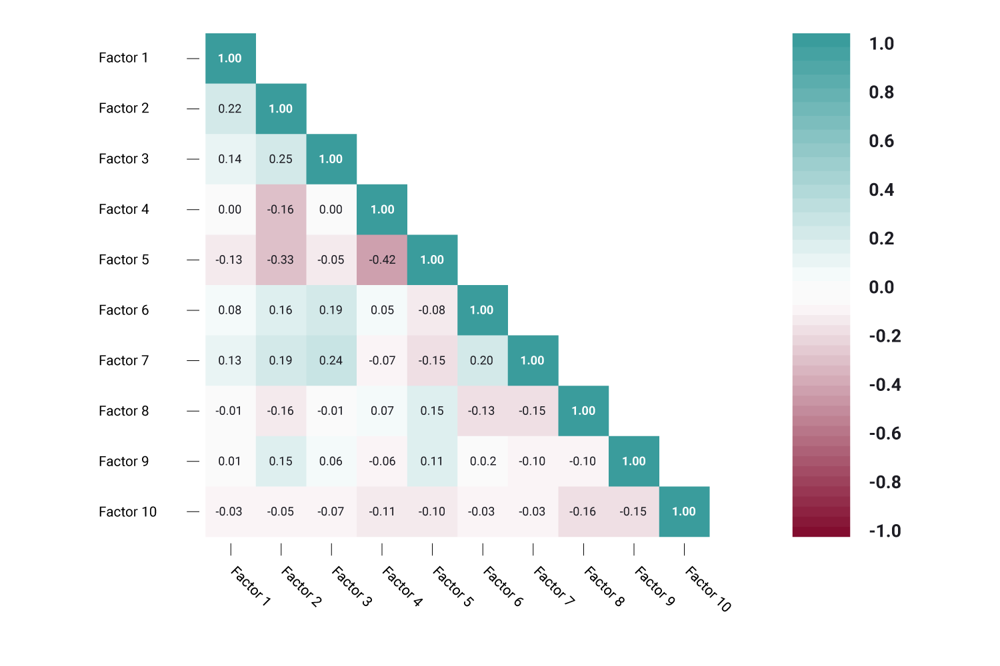

# Data Visualization

How to Visualize Data

## What is Data Visualization?

Visualisasi data adalah metode untuk merepresentasikan data melalui berbagai bentuk visual, seperti grafik, plot, infografis, dan animasi. Dengan visualisasi, hubungan dan pola dalam data yang kompleks dapat dijelaskan dengan cara yang lebih mudah dipahami oleh berbagai audiens. Visualisasi data membantu mengubah data mentah menjadi informasi yang dapat diinterpretasikan dan digunakan untuk pengambilan keputusan.

Beberapa poin penting termasuk: 
- Menerjemahkan set data yang kompleks ke dalam format visual.
- Membantu dalam analisis data dan pengambilan keputusan. 
- Memungkinkan identifikasi pola, hubungan, dan tren yang lebih cepat.

## How to Visualize Data

### Define Message

Sebelum mem-visualisasikan data, kita harus mengetahui informasi apa yang ingin kita sampaikan. Untuk memulai kita harus bisa menjawab 3 hal ini:

1. Apa tujuan dari visualisasi data ini?
2. Dalam visualisasi ini apa yang sedang kita pelajari? Apakah kita membandingkan nilai yang berbeda atau menganalisis satu tren waktu?
3. Bagaimana visualisasi ini bisa mendukung pesan kita? Misalnya, grafik kolom paling cocok untuk membandingkan 2 item dalam satu periode waktu.

### Choose the right Visualization

Setiap kumpulan data memiliki tipe data dan isi yang berbeda-beda, kita harus memahami hubungan, pola, serta informasi dan konteks yang ada pada data yang kita miliki. Kemudian, kita bisa memutuskan untuk menggunakan bentuk visualisasi yang cocok dengan data yang kita miliki.

### Focus on Clarity

Visualisasi yang baik adalah yang jelas, ringkas, dan mudah dipahami. Ada beberapa hal yang patut dipahami:

- Hanya visualisasikan informasi yang penting dan ingin kita sampaikan.
- Gunakan warna secara efektif.
- Gunakan label untuk setiap variabel dan Legenda.

### Interpret

Setelah melakukan visualisasi, kita harus mengevaluasi visualisasi kita dengan menginterpretasi apakah visualisasi yang kita buat memudahkan kita untuk memahami data yang kita miliki. 

### Storytelling & Interactivity

Sebuah visualisasi tidak hanya berupa gambar statis, visualisasi harus membantu kita menyampaikan sebuah cerita. Dengan konteks dan menunjukkan seberapa pentingnya visualisasi yang telah kita buat, kita bisa membuat audiens lebih mengerti dan tertarik. Selain itu, kita juga bisa membuat dashboard atau presentasi yang baik untuk membantu kita menyampaikan pesan yang kita miliki.

## Types of Data Visualization

### Pie Chart

Pie Chart ideal untuk mengilustrasikan proporsi, atau perbandingan bagian-ke-keseluruhan. Pie Chart relatif sederhana dan mudah dibaca, diagram ini paling cocok untuk pemirsa yang mungkin tidak terbiasa dengan informasi atau hanya tertarik pada poin-poin penting. Untuk audiens yang membutuhkan penjelasan yang lebih menyeluruh tentang data, Pie Chart tidak dapat menampilkan informasi yang kompleks dan perlu penjelasan secara detail.

### Bar Chart

Dalam Bar Chart, biasanya satu sumbu grafik menunjukkan kategori yang dibandingkan, dan sumbu lainnya menunjukkan nilai yang diukur. Panjang batang menunjukkan bagaimana setiap kelompok diukur menurut nilainya. Salah satu kekurangannya adalah pelabelan dan kejelasannya bisa menjadi masalah jika terlalu banyak kategori yang disertakan. Seperti diagram lingkaran, diagram ini juga bisa jadi terlalu sederhana untuk kumpulan data yang lebih kompleks.

### Line & Area Chart

Area chart, adalah variasi dari Line Chart d di mana area di bawah garis diarsir untuk merepresentasikan nilai total setiap titik data. Ketika beberapa seri data harus dibandingkan pada grafik yang sama, grafik area bertumpuk digunakan. Metode visualisasi data ini berguna untuk menunjukkan perubahan pada satu atau beberapa kuantitas dari waktu ke waktu, serta menunjukkan bagaimana setiap kuantitas digabungkan untuk membentuk keseluruhan. Grafik area bertumpuk efektif dalam menunjukkan perbandingan bagian-ke-keseluruhan.

### Histogram

Histogram menggambarkan distribusi data selama interval kontinu atau periode tertentu. Visualisasi ini sangat membantu dalam mengidentifikasi di mana nilai terkonsentrasi, serta di mana ada kesenjangan atau nilai yang tidak biasa. Histogram sangat berguna untuk menunjukkan frekuensi kejadian tertentu.

### Box Plot

Box Plot memberikan ringkasan visual data melalui kuartilnya. Pertama, sebuah kotak digambar dari kuartil pertama hingga kuartil ketiga dari kumpulan data. Garis di dalam kotak mewakili median. Garis kemudian digambar memanjang dari kotak ke nilai minimum (ekstrem bawah) dan maksimum (ekstrem atas). Jenis bagan ini sangat membantu dalam mengidentifikasi dengan cepat apakah data simetris atau miring, serta memberikan ringkasan visual dari kumpulan data yang dapat dengan mudah ditafsirkan.

### Scatter Plot

Scatter plot menampilkan data untuk dua variabel yang diwakili oleh titik-titik yang diplot pada sumbu horizontal dan vertikal. Jenis visualisasi data ini berguna untuk menggambarkan hubungan yang ada di antara variabel dan dapat digunakan untuk mengidentifikasi tren atau korelasi dalam data.

### Correlation Matrix

Correlation Matrix adalah sebuah tabel yang menunjukkan koefisien korelasi antar variabel. Setiap sel mewakili hubungan antara dua variabel, dan skala warna digunakan untuk mengomunikasikan apakah variabel-variabel tersebut berkorelasi dan sejauh mana. Matriks korelasi berguna untuk meringkas dan menemukan pola dalam kumpulan data yang besar. Dalam bisnis, matriks korelasi dapat digunakan untuk menganalisis bagaimana poin-poin data yang berbeda tentang produk tertentu dapat dihubungkan, seperti harga, belanja iklan, tanggal peluncuran, dll.

## Tools for Data Visualization

- Python Matplotlib & Seaborn: Library untuk membuat visualisasi statis, animasi, dan interaktif dalam Python, yang sering digunakan oleh para Data Scientist.

- Tableau: Menyediakan interface drag and drop yang sederhana untuk membuat dashboard dan visualisasi yang kompleks.

- Power BI: Software dari Microsoft untuk membuat visualisasi interaktif dan laporan bisnis.

- Microsoft Excel & Google Sheets

## Referensi
- https://online.hbs.edu/blog/post/data-visualization-techniques
- https://www.activityinfo.org/blog/posts/2023-06-29-best-practices-for-data-visualization-in-monitoring-and-evaluation.html
- https://www.atlassian.com/data/charts/how-to-choose-data-visualization