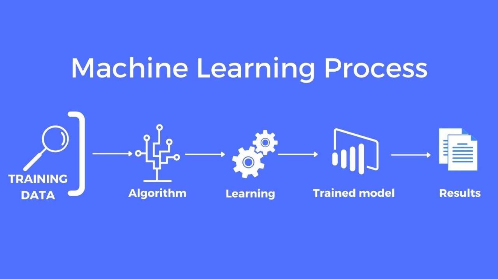
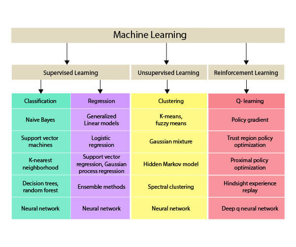
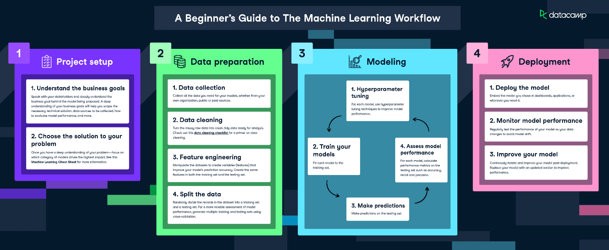
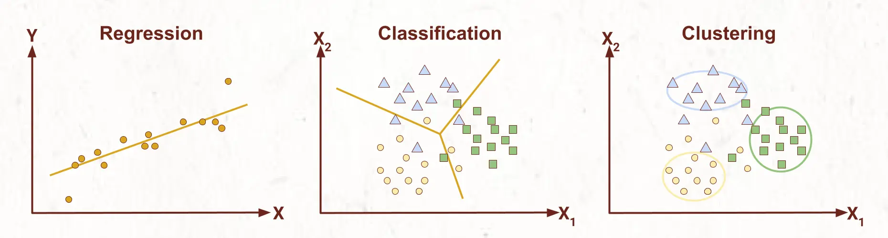
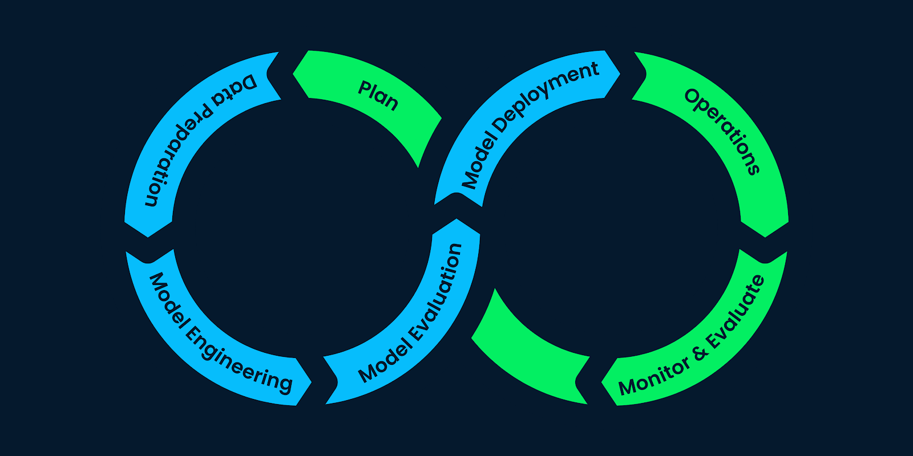

# Introduction Machine Learning

Machine Learning Fundamental

## What is Machine Learning? 

Machine Learning adalah suatu algoritma yang memungkinkan untuk suatu sistem melakukan suatu hal tanpa diprogram secara eksplisit `(Hard Coded)`. Pada awalnya Machine Learning hanya diprogram hanya dalam bentuk algoritma `if-then`. Namun, fokus Machine Learning berubah fokus menjadi algortima yang belajar dari data dan memprediksi.

## Key Concept

### Data

Data merupakan yang menjadi dasar dari semua model Machine Learning. Data yang dimaksud adalah data yang terstruktur seperti data tabular, atau data yang tidak terstruktur seperti teks. 

### Features

Feature/Fitur adalah suatu variabel independen yang digunakan model Machine Learning untuk belajar yang bertujuan untuk melakukan prediksi. Contohnya, pada model prediksi harga rumah, feature yang bisa digunakan adalah banyaknya kamar tidur, lebar rumah, dan lokasi rumah.

### Label

Label/Target merupakan variabel dependen atau biasa disebut output dari model yang kita buat. Contohnya pada model prediksi harga rumah, label adalah harga rumah yang akan diprediksi oleh model.

### Model 

Model Machine Learning merupakan adalah representasi matematika melakukan pemetaan feature-feature yang kita miliki untuk menghasilkan output berupa prediksi. Simpelnya, model adalah sebuah fungsi matematika. Dalam Machine Learning, model harus dilatih terlebih dahulu supaya model tersebut belajar dari pola-pola data yang kita miliki.

Model juga memiliki beberapa tipe belajar, diantaranya:
- **Supervised learning**: Model dilatih pada data berlabel, di mana feature input (X) dan label output (Y). Tujuannya adalah untuk mempelajari hubungan dari input ke output sehingga dapat memprediksi label untuk data yang baru.
- **Unsupervised Learning**: model dilatih pada data yang tidak berlabel, yang berarti tidak ada label output. Tujuannya adalah untuk menemukan pola, struktur, atau hubungan dalam data.
- **Reinforcement Learning**: Model belajar dengan berinteraksi dengan lingkungan. Model ini menerima feedback dalam bentuk `hadiah` atau `hukuman` berdasarkan tindakan yang dilakukannya. Cara kerjanya adalah untuk mempelajari hal yang benar dari memaksimalkan `hadiah` kumulatif dari waktu ke waktu.

### Training & Testing

Training adalah proses sebuah model untuk belajar dari data yang biasa disebut **Training Set** yang kita miliki sehingga dapat memahami hubungan antara feature dan label. Cara kerja belajar adalah dengan menyesuaikan `weights` atau `parameter` berdasarkan kesalahan yang dilakukan model sebelumnya.

Setelah dilakukan pelatihan model, kita harus mengevaluasi performa model dengan data baru yang biasa disebut **Test Set** untuk mengukur seberapa baik model kita bekerja.

## Steps in Machine Learning Project

### Problem Definition

Pertama kita harus dengan jelas, menentukan masalah yang ingin kita selesaikan dengan machine learning. Apakah masalah tersebut berhubungan dengan bisnis atau sesuatu yang teknikal? Apa output yang kita harapkan? Contohnya dalam kasus model prediksi harga rumah, kita ingin mengetahui harga rumah disuatu tempat berdasarkan lebar, jumlah kamar tidur, dan lokasi.

### Data Preparation

Karena model Machine Learning belajar dari data, maka kita harus memiliki data terlebih dahulu. Data ini bisa berasal dari manapun dan berbentuk apapun tergantung dari masalah yang ingin kita pecahkan. Contohnya database internal perusahaan, dataset publik, web scraping, API dan lainnya.

Setelah memiliki data, kita harus terlebih dahulu membersihkan dan mentransformasi data yang kita miliki sehingga mudah untuk kita melakukan analisis terhadap data yang kita miliki. Cara untuk membersihkan dan transformasi data antara lain adalah **Handling Missing Data**, **Encoding Categrical Data**, **Feature Scaling**, dan lainnya.

Setelah membershikan dan transformasi data, kita bisa melakukan **Feature Engineering** atau memilihi fitur yang cocok untuk kita gunakan dalam proses belajar model Machine Learning. Terakhir, kita bisa membagi data kita untuk **Training Set** dan **Testing Set**.

### Modelling

Model Machine Learning sangatlah banyak, untuk memilih model yang baik untuk masalah yang kita miliki adalah pertama dengan mengidentifikasi masalah yang kita miliki, apakah masalah yang akan kita pecahkan itu termasuk klasifikasi, regresi, clustering atau lainnya? Kedua, seberapa besar data yang kita miliki ada model yang bekerja dengan baik dengan data yang kecil, pun sebaliknya. Ketiga, **Kompleksitas Model** yang terlalu simpel akan mengakibatkan *undefitting* sedangkan yang terlalu rumit akan mengakibatkan *overfitting*.

- Regresi: Liner Regression, Ridge Regression
- Klasifikasi: K-Nearest-Neighbor(KNN), Logistic Regression
- Clustering: K-Means, Hierarchical Clustering

Setelah memilih model, kita bisa melakukan training model dengan *Training Set* yang kita miliki. Dalam proses ini banyak yang perlu diperhatikan seperti *Hyperparameter*, Optimisasi, Loss Function dan lainnya. Setelah ditraining, kita bisa melakukan tes kepada model yang telah kita buat dengan *Test Set* yang kita miliki. Dari tes tersebut kita bisa mengevaluasi jika model kita apakah perlu dilakukan revisi dan perbaikan.

### Deployment

Model yang telah kita buat bisa digunakan untuk melakukan prediksi dan digunakan sesuai dengan masalah yang kita miliki. Jika model kita tidak sesuai dengan yang kita inginkan, kita bisa mengupdate dan training kembali model tersebut.

## References

- https://www.datacamp.com/blog/a-beginner-s-guide-to-the-machine-learning-workflow
- https://idapgroup.com/blog/types-of-machine-learning-out-there/

