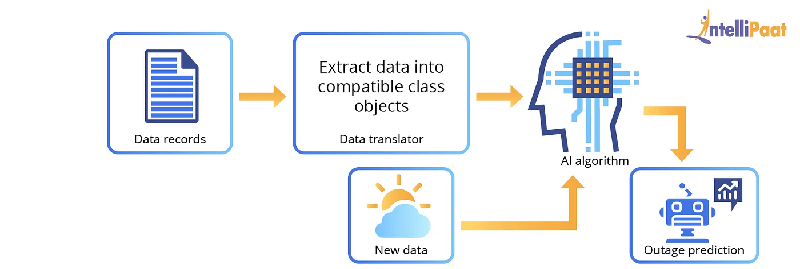

What is Artificial Intelligence? 
=====

How does AI work?

## Artificial Intelligence

Artificial Intelligence adalah teknologi pada bidang ilmu komputer yang dirancang untuk meniru kecerdasan manusia, termasuk dalam pengambilan keputusan dan logika, serta sensing keadaan/environtment sekitarnya.

## But, How does it work?

Simpelnya, cara kerja AI secara umum adalah dengan menggabungkan kumpulan data dengan ilmu komputer. Selanjutnya, AI ini akan menyerap sejumlah data untuk mengidentifikasi pola dari data tersebut. Nah, dari pola itu kita bisa menentukan decision apa yang bakal kita lakukan selanjutnya.

### Pengumpulan Data

Karena cara kerja AI adalah menyerap data atau belajar dari data, kita harus memiliki data dari suatu problem yang bakal kita atasi terlebih dahulu. Contohnya, jika kita mau bikin AI yang bisa mendeteksi kalo kalian bakal diterima sama gebetan kalian atau ngga? Kalian harus cari tau dulu tuh si cewe/cowo sukanya sama kaya **perlakuan, fisik dan personality** yang kaya gimana dulu. Apakah dia suka cogil/cegil? atau dia suka cowo/cewe yang baik baik aja? Kalian bisa tau ini semua dari track record mantan si cewe/cowo itu kan. Nah dari situ kalian harus udah ngumpulin info-infonya dulu tuh.

> **Sorry ya, kalo analoginya jelek KWKWKWK**

### Pemrosesan Data

Habis kalian ngumpulin data, data ini harus kalian proses dulu nih. Maksudnya apa tuh kack? maksudnya data kalian ini bener bener valid atau ada yang kosong. Misal, ada cowo misterius yang kalian tuh gatau perlaukan dan personality-nya, jadi kalian ngumpulin data yang kosong di 2 hal itu. Kalian bisa handle kalo si cowo ini termasuk anomali atau ngga? Kalo misal kalian pilih dia ini termasuk anomali mungkin kalian bisa buang dari dataset kalian. 

> **Sorry ya, kalo analoginya jelek KWKWKWK (lagi)**

### Model dan Learning

Kemudian masuk ke proses modelling. Model yang dimaksud disini adalah model Machine Learning. Apa itu model Machine Learning? Model Machine Learning itu bisa di analogikan kaya bayi yang baru lahir. Bayi yang baru lahir itu gatau apa apa, sama kaya model machine learning yang baru kita buat. Model ini kita bisa latih dengan dataset yang kita punya sebelumnya biar. Yang awalnya model ini gatau apa apa, setelah belajar dia bisa meniru sebagaimana kita berpikir. Model ini sebenernya adalah sebuah fungsi matematika yang dioptimisasi sehingga bisa mengikuti bagaimana manusia berpikir. Jadi, semua hal yang ada di dalam AI itu sebenernya hanya sebatas fungsi matematika `f(x)`.

> **Gampang kan?**

Model ini bisa kita tunjukkan ke pekerjaan yang beda-beda, tergantung dari masalah yang mau kita selesaikan. Gimana cara tau jika model kita bagus atau jelek? Kerja model ini bisa evaluasi lewat metrik-metrik tertentu kaya akurasi, presisi, dan lainnya. Yaaa memang banyak matematikanya sih tapi tetep...

> **EZ**

### New Data dan Deployment

Model yang sudah dirasa bagus bisa kita pakai di masalah dunia nyata buat bantu kita kerja manusia sehari-hari. Ini adalah cara kerja AI yang sebenernya dan masih banyak lagi. Tapi, jangan khawatir kita bakal belajar semuanya.

> **Infokan Copywriter**